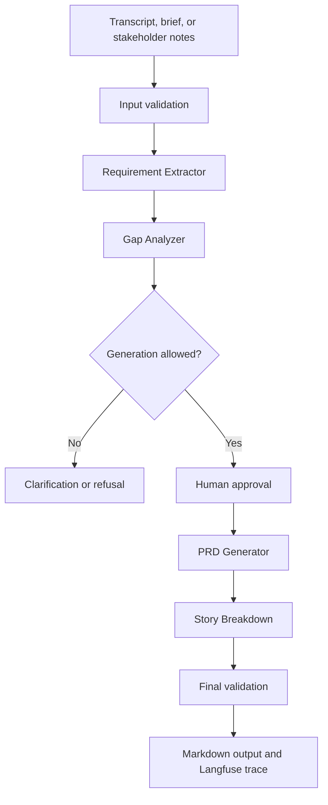

# PRD Genie

AI-powered product documentation assistant that converts meeting transcripts, product briefs, and stakeholder notes into grounded requirements, structured PRDs, epics, and user stories.

## Project status

**Phase:** Iterations 1 and 2 are complete for the current T1–T10 scope. Human-approved ground truth, automated evaluation, n8n execution evidence, and Langfuse traces are recorded; the promoted v1.5 Requirement Extractor passed the unchanged T1–T10 release gate 10/10.

The planned implementation uses:

- **n8n** for sequential workflow orchestration
- **Langfuse** for observability and evaluation
- **OpenAI `gpt-5.6-terra`** with medium reasoning as the initial extraction baseline
- **Gap Analysis** as the extended capability
- **Human approval** between requirement extraction and PRD generation

## Problem

Product managers spend significant time translating fragmented meeting transcripts and stakeholder notes into consistent documentation. Important details can be lost, while ambiguous input can become unsupported requirements. PRD Genie addresses this with evidence-linked extraction, explicit gap handling, controlled generation, and end-to-end traceability.

## Core capabilities

1. Extract functional and non-functional requirements, acceptance criteria, stakeholders, constraints, dependencies, deadlines, contradictions, and missing information.
2. Generate a structured PRD using the supplied ten-section template.
3. Break approved PRDs into epics, features, and user stories.
4. Identify information gaps and generate clarification questions.
5. Trace outputs back to source evidence and record execution data in Langfuse.

## Architecture



The sequential pattern is intentional: each stage depends on an approved output from the previous stage. Material ambiguity or insufficient input blocks downstream generation.

Foundational documentation:

- [`BRD.md`](docs/requirements/BRD.md) - why the business needs PRD Genie
- [`PRODUCT_PRD.md`](docs/requirements/PRODUCT_PRD.md) - what the product must deliver
- [`ARCHITECTURE_DESIGN.md`](docs/architecture/ARCHITECTURE_DESIGN.md) - how the system is designed and how it will evolve
- [`EXTRACTION_STATUS_GUIDE.md`](docs/architecture/EXTRACTION_STATUS_GUIDE.md) - authoritative human-readable definitions for `complete`, `partial`, and `no_requirements`
- [`ITERATION_PLAN.md`](docs/planning/ITERATION_PLAN.md) - formal four-week plan and compressed execution target
- [`evaluation/ground-truth/`](evaluation/ground-truth/README.md) - human-reviewed canonical evaluation-data plan
- [`evaluate_extraction.py`](scripts/evaluate_extraction.py) - deterministic T1-T10 evaluator and scorecard generator

## Repository structure

```text
prd-genie/
├── README.md
├── .env.example
├── .gitignore
├── docs/
│   ├── architecture/
│   ├── requirements/
│   ├── planning/
│   ├── assignments/
│   ├── decisions/
│   └── submission/
├── workflows/
│   └── n8n/
├── prompts/
├── schemas/
├── evaluation/
│   ├── fixtures/
│   ├── ground-truth/
│   ├── results/
│   └── scorecards/
├── examples/
│   ├── inputs/
│   └── outputs/
├── assets/
│   ├── diagrams/
│   └── screenshots/
└── demo/
```

See [`docs/REPOSITORY_GUIDE.md`](docs/REPOSITORY_GUIDE.md) for artifact placement and naming conventions.

## Validated workflow contracts

Seven standalone JSON Schema Draft 2020-12 contracts define the boundaries between workflow stages:

- Workflow input
- Requirement extraction
- Gap analysis and generation gate
- Human review
- PRD output
- Story breakdown
- Evaluation result

The contracts, field documentation, and controlled values are in [`schemas/`](schemas/README.md). The grounding rules and traceability model are in [`docs/architecture/GROUNDING_POLICY.md`](docs/architecture/GROUNDING_POLICY.md) and [`docs/architecture/TRACEABILITY.md`](docs/architecture/TRACEABILITY.md).

Fifteen representative payloads cover T1, T2, T3, and T9 under [`examples/contracts/`](examples/contracts/). All schemas and examples pass automated validation.

## Requirement Extractor package

The initial extractor implementation package includes:

- [`prompts/requirement-extractor-v0.8.md`](prompts/requirement-extractor-v0.8.md) - current provider-neutral system prompt with cumulative evaluation corrections
- [`evaluation/fixtures/t01-t10-extractor-cases.json`](evaluation/fixtures/t01-t10-extractor-cases.json) - machine-readable T1-T10 expectations
- [`workflows/n8n/REQUIREMENT_EXTRACTOR_MAPPING.md`](workflows/n8n/REQUIREMENT_EXTRACTOR_MAPPING.md) - initial node sequence, data mapping, validation, and retry behavior
- [`workflows/n8n/prd-genie-requirement-extractor-v0.2.json`](workflows/n8n/prd-genie-requirement-extractor-v0.2.json) - importable inactive ten-node T1 workflow with Langfuse OTLP tracing
- [`workflows/n8n/IMPORT_AND_TEST.md`](workflows/n8n/IMPORT_AND_TEST.md) - n8n Cloud import, configuration, and first-test guide
- [`scripts/validate_extractor_package.py`](scripts/validate_extractor_package.py) - offline integrity checks for prompt controls and baseline coverage
- [`evaluation/results/t1-requirement-extractor-rerun.md`](evaluation/results/t1-requirement-extractor-rerun.md) - successful corrected T1 run evidence and learning

The model decision and comparison plan are documented in [`ADR-003`](docs/decisions/ADR-003-openai-model-baseline.md).

## Additional n8n recovery exports

- [`workflows/n8n/prd-genie-gap-analyzer-generation-gate-v1.0.json`](workflows/n8n/prd-genie-gap-analyzer-generation-gate-v1.0.json) - validated inactive export of the promoted 11-node Gap Analyzer and deterministic Generation Gate workflow
- [`workflows/n8n/prd-genie-human-approval-v0.1.json`](workflows/n8n/prd-genie-human-approval-v0.1.json) - inactive seven-node Human Approval workflow with Langfuse audit delivery
- [`workflows/n8n/prd-genie-failure-observer-v0.1.json`](workflows/n8n/prd-genie-failure-observer-v0.1.json) - inactive failure-observability workflow

Exports contain credential references by ID and name, not API-key values. Credentials must be reconnected after recovery import.

## Baseline evaluation

The current cross-stage status and evidence chain are maintained in the [`PRD Genie End-to-End Test Traceability Matrix`](evaluation/END_TO_END_TEST_TRACEABILITY_MATRIX.md).

The project includes 12 required baseline cases:

- T1-T10 evaluate extraction, ambiguity handling, contradictions, exact-value preservation, personas, empty input, and dependencies.
- T11 evaluates PRD generation from the approved T1 extraction.
- T12 evaluates epic and story generation from the T11 PRD.

The target release gate is **12/12 baseline tests passing with zero unsupported requirements** in the final evaluated run.

Results will be summarized in [`evaluation/results/baseline-summary.md`](evaluation/results/baseline-summary.md) and supported by detailed run evidence.

T1-T10 have documented Requirement Extractor results. T10 includes a passing v0.8 before/after correction trace. Earlier partial and failed cases remain honest baseline evidence and will inform the ground-truth evaluation and final regression. T11-T12 will be executed after the remaining agents and human-approval gate are implemented.

## Grounding principles

- Use only the supplied input or approved upstream output.
- Preserve names, numbers, dates, versions, and units exactly.
- Keep stated, suggested, ambiguous, contradictory, and missing information distinct.
- Never resolve contradictions on behalf of stakeholders.
- Use `TBD - stakeholder input required` for missing template information.
- Refuse PRD generation when no meaningful requirements are extractable.
- Maintain source IDs from extraction through PRD and story output.

## Running the project

The Requirement Extractor and its Langfuse/failure-observability path are implemented. Remaining agents are planned. To validate the current contract package:

```bash
python3 -m venv .venv
.venv/bin/python -m pip install -r requirements-dev.txt
.venv/bin/python scripts/validate_contracts.py
.venv/bin/python scripts/validate_extractor_package.py
```

No credentials or secrets should be committed. Copy `.env.example` to your local secret-management approach and configure credentials directly in n8n and Langfuse.

## Submission evidence

The final repository will contain:

- Exported n8n workflow JSON
- Architecture and orchestration rationale
- Agent prompts and structured-output schemas
- Baseline outputs and results for T1-T12
- Langfuse trace screenshots and evaluation evidence
- Cost and latency analysis
- Assignment responses and reflection
- Demo script and five-minute video link
- Screenshots of the workflow canvas and PRD Genie in action

## Limitations

- PRD Genie assists product managers; it does not replace stakeholder validation.
- Priority and scope suggestions must be reviewed before approval.
- Generated documents are only as reliable as their source material and configured validation gates.
