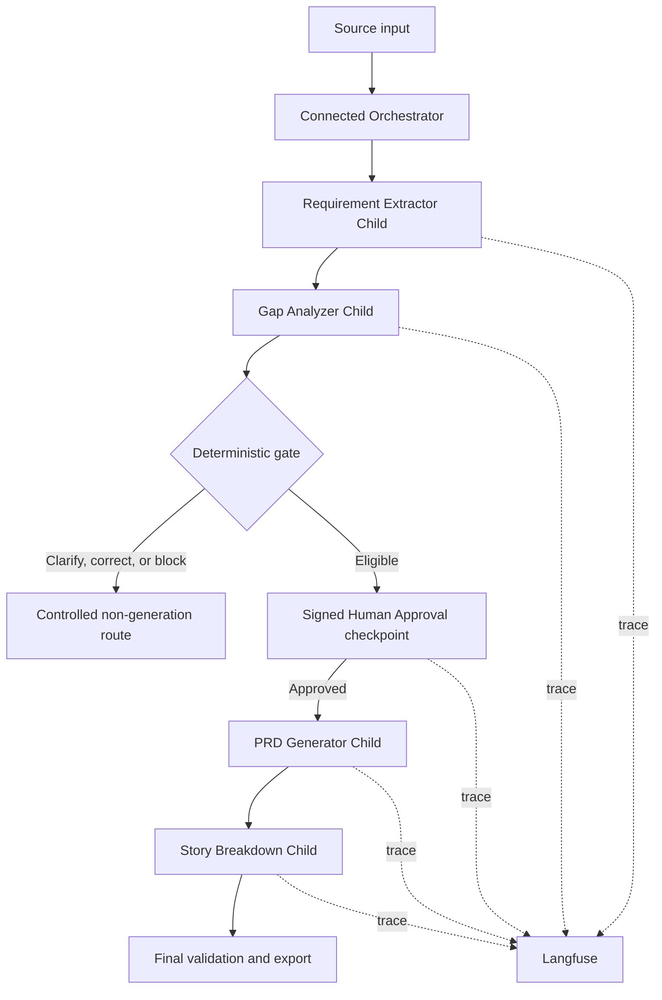

# PRD Genie

AI-powered product documentation assistant that converts meeting transcripts, product briefs, and stakeholder notes into grounded requirements, structured PRDs, epics, and user stories.

## Project status

**Phase:** The v0.3.8 capstone implementation and submission package are complete. The governed pipeline covers intake, requirement extraction, gap analysis, signed human approval, ten-section PRD generation, story breakdown, final validation and export, and non-blocking story sizing. All prescribed T1–T12 baseline cases passed against human-reviewed ground truth with 100% groundedness and zero unsupported claims.

**Submission candidate:** The complete accepted v0.3.8 workflow and evidence package is available at [`releases/v0.3.8/`](releases/v0.3.8/README.md). It preserves parent execution `11901`, run `RUN-S2-11902-16e7090e`, all nine workflow exports, the three planning artifacts, and the complete citation disposition evidence.

**Complete demo:** [PRD Genie v0.3.8 — Complete Demo with Artifacts](https://github.com/vppuri-vjra/prd-genie/releases/tag/v0.3.8-complete-demo) is a 7:08 reviewer walkthrough. Execution `11958` / `RUN-S2-11959-16e7090e` is supplementary demonstration evidence and does not replace the formal baseline.

**Submission portal:** [Q1–Q4 responses, overall deliverables, presentation, and download index](https://vjra.us/prd-genie.html).

The implemented system uses:

- **n8n** for sequential workflow orchestration
- **Langfuse** for observability and evaluation
- **OpenAI `gpt-5.6-terra`** with medium reasoning as the initial extraction baseline
- **Gap Analysis** as the extended capability
- **Human approval** between requirement extraction and PRD generation

## Problem

Product managers spend significant time translating fragmented meeting transcripts and stakeholder notes into consistent documentation. Important details can be lost, while ambiguous input can become unsupported requirements. PRD Genie addresses this with evidence-linked extraction, explicit gap handling, controlled generation, and end-to-end traceability.

## Core capabilities

1. Extract functional and non-functional requirements, acceptance criteria, stakeholders, constraints, dependencies, deadlines, contradictions, and missing information.
2. Generate a structured PRD using the supplied ten-section template.
3. Break approved PRDs into epics, features, and user stories.
4. Identify information gaps and generate clarification questions.
5. Trace outputs back to source evidence and record execution data in Langfuse.

## Architecture



The sequential pattern is intentional: each stage depends on an approved output from the previous stage. Material ambiguity or insufficient input blocks downstream generation.

Foundational documentation:

- [`BRD.md`](docs/requirements/BRD.md) - why the business needs PRD Genie
- [`PRODUCT_PRD.md`](docs/requirements/PRODUCT_PRD.md) - what the product must deliver
- [`ARCHITECTURE_DESIGN.md`](docs/architecture/ARCHITECTURE_DESIGN.md) - how the system is designed and how it will evolve
- [`EXTRACTION_STATUS_GUIDE.md`](docs/architecture/EXTRACTION_STATUS_GUIDE.md) - authoritative human-readable definitions for `complete`, `partial`, and `no_requirements`
- [`DOCUMENT_CLASSIFICATION_REGISTER.md`](docs/architecture/DOCUMENT_CLASSIFICATION_REGISTER.md) - authoritative Document Type and Used By boundaries for production evidence, human decisions, and evaluation adjudications
- [`ITERATION_PLAN.md`](docs/planning/ITERATION_PLAN.md) - formal four-week plan and compressed execution target
- [`evaluation/ground-truth/`](evaluation/ground-truth/README.md) - human-reviewed canonical evaluation-data plan
- [`evaluate_extraction.py`](scripts/evaluate_extraction.py) - deterministic T1-T10 evaluator and scorecard generator

## Repository structure

```text
prd-genie/
├── README.md
├── .env.example
├── .gitignore
├── docs/
│   ├── architecture/
│   ├── requirements/
│   ├── planning/
│   ├── assignments/
│   ├── decisions/
│   └── submission/
├── workflows/
│   └── n8n/
├── prompts/
├── schemas/
├── evaluation/
│   ├── fixtures/
│   ├── ground-truth/
│   ├── results/
│   └── scorecards/
├── examples/
│   ├── inputs/
│   └── outputs/
├── assets/
│   ├── diagrams/
│   └── screenshots/
└── demo/
```

See [`docs/REPOSITORY_GUIDE.md`](docs/REPOSITORY_GUIDE.md) for artifact placement and naming conventions.

## Validated workflow contracts

Seven standalone JSON Schema Draft 2020-12 contracts define the boundaries between workflow stages:

- Workflow input
- Requirement extraction
- Gap analysis and generation gate
- Human review
- PRD output
- Story breakdown
- Evaluation result

The contracts, field documentation, and controlled values are in [`schemas/`](schemas/README.md). The grounding rules and traceability model are in [`docs/architecture/GROUNDING_POLICY.md`](docs/architecture/GROUNDING_POLICY.md) and [`docs/architecture/TRACEABILITY.md`](docs/architecture/TRACEABILITY.md).

Fifteen representative payloads cover T1, T2, T3, and T9 under [`examples/contracts/`](examples/contracts/). All schemas and examples pass automated validation.

## Requirement Extractor package

The initial extractor implementation package includes:

- [`prompts/requirement-extractor-v0.8.md`](prompts/requirement-extractor-v0.8.md) - current provider-neutral system prompt with cumulative evaluation corrections
- [`evaluation/fixtures/t01-t10-extractor-cases.json`](evaluation/fixtures/t01-t10-extractor-cases.json) - machine-readable T1-T10 expectations
- [`VALID_N8N_WORKFLOW_REGISTRY.md`](docs/architecture/VALID_N8N_WORKFLOW_REGISTRY.md) - authoritative live workflow allowlist by name and immutable n8n ID
- [`workflows/n8n/REQUIREMENT_EXTRACTOR_MAPPING.md`](workflows/n8n/REQUIREMENT_EXTRACTOR_MAPPING.md) - initial node sequence, data mapping, validation, and retry behavior
- [`workflows/n8n/prd-genie-requirement-extractor-v0.2.json`](workflows/n8n/prd-genie-requirement-extractor-v0.2.json) - importable inactive ten-node T1 workflow with Langfuse OTLP tracing
- [`workflows/n8n/IMPORT_AND_TEST.md`](workflows/n8n/IMPORT_AND_TEST.md) - n8n Cloud import, configuration, and first-test guide
- [`scripts/validate_extractor_package.py`](scripts/validate_extractor_package.py) - offline integrity checks for prompt controls and baseline coverage
- [`evaluation/results/t1-requirement-extractor-rerun.md`](evaluation/results/t1-requirement-extractor-rerun.md) - successful corrected T1 run evidence and learning

The model decision and comparison plan are documented in [`ADR-003`](docs/decisions/ADR-003-openai-model-baseline.md).

## Additional n8n recovery exports

- [`workflows/n8n/prd-genie-gap-analyzer-generation-gate-v1.0.json`](workflows/n8n/prd-genie-gap-analyzer-generation-gate-v1.0.json) - validated inactive export of the promoted 11-node Gap Analyzer and deterministic Generation Gate workflow
- [`workflows/n8n/prd-genie-human-approval-v0.1.json`](workflows/n8n/prd-genie-human-approval-v0.1.json) - inactive seven-node Human Approval workflow with Langfuse audit delivery
- [`workflows/n8n/prd-genie-failure-observer-v0.1.json`](workflows/n8n/prd-genie-failure-observer-v0.1.json) - inactive failure-observability workflow

Exports contain credential references by ID and name, not API-key values. Credentials must be reconnected after recovery import.

## Baseline evaluation

The current cross-stage status and evidence chain are maintained in the [`PRD Genie End-to-End Test Traceability Matrix`](evaluation/END_TO_END_TEST_TRACEABILITY_MATRIX.md).

The production-style ingestion route is defined by [`SOURCE_PACKET_CONTRACT.md`](docs/architecture/SOURCE_PACKET_CONTRACT.md). It represents T1 as separate Product Brief, Meeting Transcript and Stakeholder Notes fixtures while keeping `eval_prdgenie_inputs` as an alternative regression/control producer of the same logical Requirement Extractor input boundary. n8n execution `9638` passed this route at 100% groundedness with zero unsupported claims and accepted Langfuse trace `2f0e20055d7765ca3bb0bb0d2bea866b`.

The broader [`realistic-v1`](evaluation/fixtures/multi-source/realistic-v1/) intake preserves the three supplied capstone resources byte-for-byte with 70 reviewed citations. Input grounding is 100%; model execution remains gated on approval of its expected unified extraction.

The project includes 12 required baseline cases:

- T1-T10 evaluate extraction, ambiguity handling, contradictions, exact-value preservation, personas, empty input, and dependencies.
- T11 evaluates PRD generation from the approved T1 extraction.
- T12 evaluates epic and story generation from the T11 PRD.

The target release gate is **12/12 baseline tests passing with zero unsupported requirements** in the final evaluated run.

Final results are recorded in the [`T1–T12 baseline summary`](evaluation/results/baseline-summary.md) and supported by preserved run metadata, n8n execution receipts, Langfuse traces, ground-truth records, and presentation Appendices A5–A7. Earlier partial and failed development runs remain in repository history as iteration evidence; they do not replace the final 12/12 release disposition.

## Grounding principles

- Use only the supplied input or approved upstream output.
- Preserve names, numbers, dates, versions, and units exactly.
- Keep stated, suggested, ambiguous, contradictory, and missing information distinct.
- Never resolve contradictions on behalf of stakeholders.
- Use `TBD - stakeholder input required` for missing template information.
- Refuse PRD generation when no meaningful requirements are extractable.
- Maintain source IDs from extraction through PRD and story output.

## Running the project

The full v0.3.8 workflow set is preserved under [`releases/v0.3.8/workflows/`](releases/v0.3.8/workflows/). To validate the repository contract package locally:

```bash
python3 -m venv .venv
.venv/bin/python -m pip install -r requirements-dev.txt
.venv/bin/python scripts/validate_contracts.py
.venv/bin/python scripts/validate_extractor_package.py
```

No credentials or secrets should be committed. Copy `.env.example` to your local secret-management approach and configure credentials directly in n8n and Langfuse.

## Submission evidence

The final repository contains:

- Exported n8n workflow JSON
- Architecture and orchestration rationale
- Agent prompts and structured-output schemas
- Baseline outputs and results for T1-T12
- Langfuse trace screenshots and evaluation evidence
- Cost and latency analysis
- Q1–Q4 assignment responses and reflection through the [submission portal](https://vjra.us/prd-genie.html)
- [Complete Demo with Artifacts](https://github.com/vppuri-vjra/prd-genie/releases/tag/v0.3.8-complete-demo)
- [Supplementary Langfuse evidence for execution 11958](releases/v0.3.8/evidence/langfuse/Langfuse-Complete-Trace-Evidence-11958.html)
- Screenshots of the workflow canvas and PRD Genie in action

## Limitations

- PRD Genie assists product managers; it does not replace stakeholder validation.
- Priority and scope suggestions must be reviewed before approval.
- Generated documents are only as reliable as their source material and configured validation gates.
