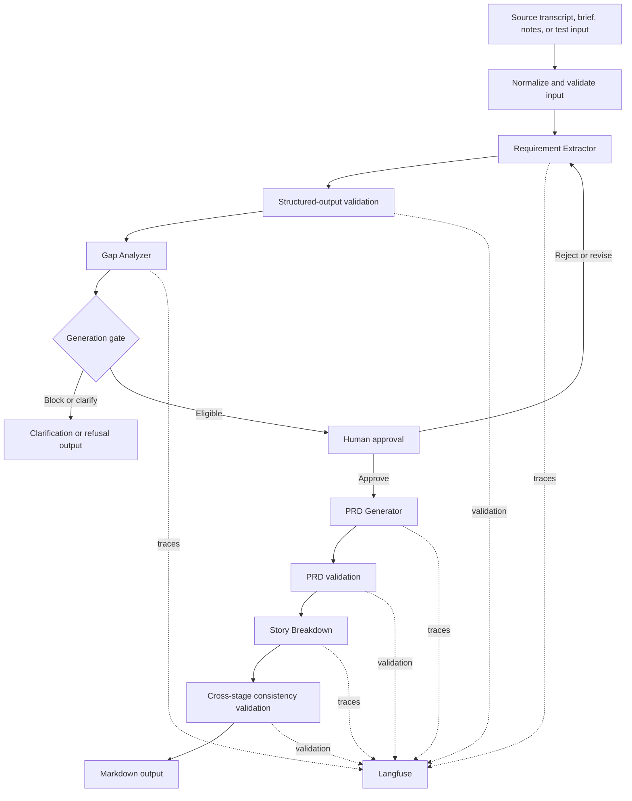

# PRD Genie Architecture Design

## 1. Purpose and status

This document defines the baseline architecture for PRD Genie. Requirement Extraction, Gap Analysis, deterministic generation routing, signed Human Approval, PRD Generation, Story Breakdown, and Langfuse tracing are implemented. Standalone release regressions have passed, and Connected Orchestrator v0.4 has proven the contiguous T1-to-T12 path at 100% groundedness through the `final_validation` route. Final cross-stage validation/export, shared-source ingestion, and full-pipeline regression remain planned.

## 2. Architecture principles

1. Ground every factual output in approved evidence.
2. Use one clear responsibility per agent.
3. Exchange strict, versioned JSON contracts between stages.
4. Stop or request clarification when input is insufficient or materially contradictory.
5. Require human approval before generative document creation.
6. Preserve stable IDs across the complete evidence chain.
7. Trace every LLM stage and visible failure path.
8. Prefer incremental implementation over unnecessary orchestration complexity.

## 3. System context

PRD Genie receives source text from a PM, TPM, evaluator, or file-ingestion step. n8n normalizes and validates the input, coordinates agents, applies routing and approval gates, and exports the final Markdown. OpenAI performs structured language tasks. Langfuse records traces and evaluation evidence. GitHub stores versioned implementation and submission artifacts; Obsidian mirrors working project documentation.

## 4. Logical architecture



The editable diagram source is also stored in `assets/diagrams/prd-genie-architecture-v0.1.mmd`.

## 5. Orchestration pattern

PRD Genie uses a sequential pipeline because each downstream artifact depends on an approved upstream artifact. Extraction must precede PRD generation, and the approved PRD must precede story generation. Conditional branches handle clarification, refusal, validation failure, and human revision without changing the main dependency chain.

A router is unnecessary for the MVP because normalized inputs share the same semantic stages. Hierarchical orchestration would add coordination complexity without improving the supplied single-source baseline cases.

### 5.1 Why Gap Analysis precedes PRD generation

The Gap Analyzer is intentionally placed between validated Requirement Extraction and the PRD Generator. Architecturally, it is a pre-generation readiness and safety boundary: the Requirement Extractor establishes what the evidence says, the Gap Analyzer determines whether that evidence is sufficiently complete and internally consistent for controlled generation, and the PRD Generator formats only information that has passed the gate and human review.

This placement provides the following architectural benefits:

| Concern | Architectural rationale |
|---|---|
| Separation of concerns | Extraction, readiness assessment, and document generation remain distinct responsibilities with separate contracts. |
| Fail-fast behavior | Material gaps and contradictions stop or redirect the pipeline before downstream model calls create a PRD or stories. |
| Hallucination prevention | Unknown information is clarified, blocked, or explicitly marked for `TBD` treatment instead of being silently completed by a generator. |
| Stable downstream contract | The PRD Generator receives an approved extraction plus an explicit eligibility decision rather than interpreting readiness itself. |
| Lower coupling | The Gap Analyzer needs the Requirement Extraction contract only; it does not need to understand both PRD and Story output structures. |
| Reduced cost and rework | The pipeline avoids generating and later discarding a PRD and story set when the source is not ready. |
| Traceability and observability | The sequence `extract -> analyze -> gate -> approve -> generate` records why generation was allowed, clarified, or blocked. |
| Human control | The deterministic gate routes eligible cases to approval before any generative document-creation stage begins. |

Placing a checker only after PRD and Story generation would detect some defects, but only after unsupported assumptions or contradictions may have propagated across multiple artifacts. Downstream checking therefore remains valuable but has a different responsibility:

- the pre-generation **Gap Analyzer** evaluates source sufficiency, ambiguity, contradictions, risks, and generation readiness;
- the post-generation **PRD Validator** evaluates PRD grounding, completeness, template compliance, and approved-source use; and
- the post-generation **Story/Consistency Validator** evaluates story coverage, acceptance criteria, and cross-stage traceability.

The approved architectural decision is therefore to retain the Gap Analyzer before the PRD Generator and use specialized downstream validators as additional controls rather than moving the Gap Analyzer to the end of the pipeline.

Decision-rationale groundedness: **100%**. The placement follows the approved sequential orchestration, strict stage contracts, deterministic generation gate, human-approval requirement, traceability model, and zero-unsupported-claim target.

## 6. Components and responsibilities

| Component | Responsibility | Input contract | Output contract | Status |
|---|---|---|---|---|
| Input Normalizer | Create a consistent run envelope | Raw source | Workflow Input | Implemented |
| Input Validator | Reject invalid envelopes | Workflow Input | Validated Workflow Input | Implemented |
| Requirement Extractor | Extract grounded product information | Workflow Input | Requirement Extraction | Implemented; v1.5 release regression passed 10/10 |
| Gap Analyzer | Identify missing, ambiguous, contradictory, or blocking information | Requirement Extraction | Gap Analysis | Implemented; v1.0 release regression passed 10/10 |
| Generation Gate | Route according to sufficiency and safety | Gap Analysis | Gate decision | Implemented and verified across T1-T10 |
| Human Approval | Approve, condition, reject, or redirect grounded items | Extraction, Gap Analysis and gate result | Human Review | Implemented; all five eligible T-test routes passed at 100% with Langfuse evidence |
| PRD Generator | Produce the ten-section Markdown PRD | Approved extraction and template | PRD Output | Implemented for T11/T1; observable release passed at 100%, actual JSON/Markdown preserved, Langfuse accepted |
| Story Breakdown | Produce epics, features, and stories | Approved PRD | Story Breakdown | Implemented for T12/T1; observable v0.2 release passed at 100%, actual JSON/Markdown preserved, Langfuse accepted |
| Connected Orchestrator | Own the run envelope, invoke children, preserve trace context, and enforce routes | Workflow Input and stage envelopes | Connected stage result | Implemented through v0.4; connected T1-to-T12 canary passed at 100% and reached `final_validation` |
| Final Validator | Enforce cross-stage grounding and consistency | All downstream outputs | Evaluation Result | Planned |
| Failure Observer | Record workflow failures | n8n error event | Failure trace | Implemented |
| Langfuse Adapter | Emit trace, generation, validation, usage, cost, and deterministic approval-audit data | Run context and stage data | Accepted trace | Implemented for Requirement Extractor, Gap Analyzer, Human Approval, PRD Generation, Story Breakdown, and connected canaries; model token counts remain unavailable where n8n chain output does not expose them |

## 7. Data contracts

Nine design areas are represented through seven standalone JSON schemas and supporting objects: Workflow Input, Requirement Extraction, Gap Analysis, Human Review, PRD Output, Story Breakdown, and Evaluation Result. Contracts reject unknown properties, control status values, preserve IDs, and require source evidence or approved upstream references.

Schema changes require a version update, regression validation, and documentation of downstream impact.

## 8. Grounding and traceability

The target is 100% traceability of factual generated items and zero unsupported claims in the final evaluated baseline. Grounding does not imply perfect extraction completeness; completeness and classification accuracy are measured independently.

```text
Source quote -> Extracted ID -> Human approval -> PRD ID -> Story ID -> Evaluation and trace
```

Missing mandatory PRD content is written as `TBD - stakeholder input required` and linked to an open question. Contradictions remain unresolved until a human supplies a decision.

## 9. Human approval design

The approval stage receives the extraction, Gap Analysis, and deterministic gate result. It records the reviewer, timestamp, decision, approved/rejected IDs, reviewed gaps, controlled TBDs, conditions, evidence checks, notes, and deterministic next route. Material content revisions are not silently authored in the checkpoint; they return to correction for re-extraction and evaluation. Only approved content and explicitly approved conditions/TBDs are passed to the PRD Generator. Rejected or unreviewed items cannot appear downstream. The complete contract is defined in `docs/architecture/HUMAN_APPROVAL_CONTRACT.md`.

## 10. Observability

Each LLM stage should create a Langfuse generation nested under one pipeline trace. Required metadata includes run ID, test ID, agent name, prompt version, model, input, output, validation, latency, input/output tokens, estimated cost, environment, and error details. Validation and failure observations remain visible even when the pipeline stops.

The Requirement Extractor, Gap Analyzer, PRD Generator, and Story Breakdown stages use root, generation, and validation observations plus deterministic stage observations. Human Approval emits a non-LLM `human-approval` span with the decision, route, evidence checks, 100% groundedness, `model_call=false`, and zero token usage. Connected Orchestrator v0.4 preserves one parent trace ID across stage envelopes while each child records its own stage trace. The verified connected Story Breakdown trace is `8e7fc5b6a49f0ef550fdee4f4b76f4ca` in Langfuse US.

## 11. Failure handling

| Failure | Response |
|---|---|
| Invalid workflow input | Stop before the LLM and record validation failure |
| Invalid model JSON | Parse or retry only within documented limits; otherwise stop and trace failure |
| Schema violation | Block downstream execution and record exact validation errors |
| No meaningful requirements | Return refusal and clarification request; do not generate PRD |
| Blocking ambiguity or contradiction | Request clarification and prevent generation |
| Human rejection | Return for revision or stop according to reviewer decision |
| Langfuse ingestion issue | Preserve workflow result and record observability failure for remediation |

## 12. Security and privacy

- Secrets remain in n8n credentials or approved environment configuration.
- Workflow exports are inspected before commit.
- Screenshots exclude credentials, account identifiers, personal email addresses, and secret-bearing URLs.
- Supplied project resources remain read-only.
- The repository remains private during active development and contains only submission-safe artifacts; visibility can be changed before grading if the submission rules require reviewer access.

## 13. Deployment and environments

The capstone baseline runs in n8n Cloud and sends evaluation traces to the Langfuse US project. The exported workflows remain inactive by default in GitHub. Production deployment, scaling, retention, identity management, and enterprise access controls are outside the MVP and require future design.

## 14. Architecture evolution

This architecture baseline is version 0.3. Material changes are reflected in this document and in an ADR. Earlier accepted ADRs are not silently rewritten; a new ADR may supersede an earlier decision. Implementation status is updated as components move from planned to implemented and evaluated.
