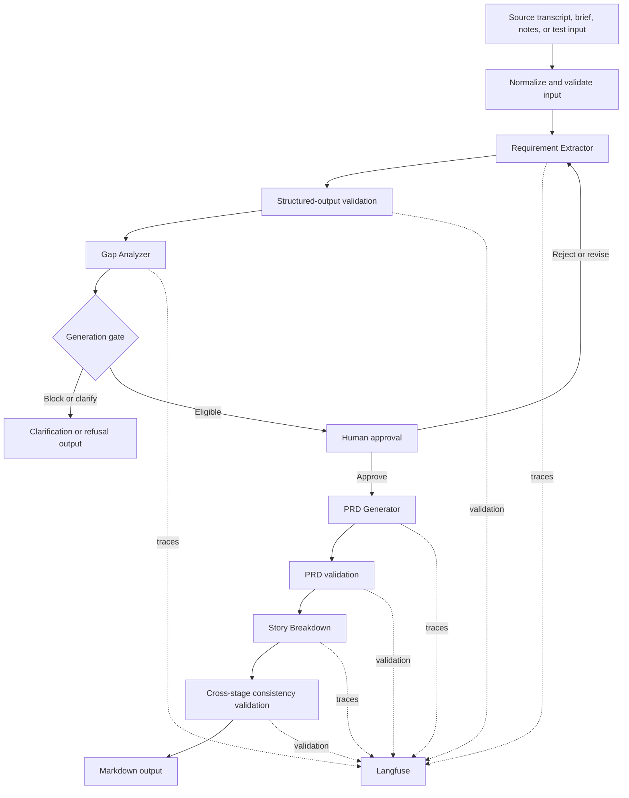

# PRD Genie Architecture Design

## 1. Purpose and status

This document defines the baseline architecture for PRD Genie. Requirement Extraction and Langfuse tracing are implemented. Gap Analysis, Human Approval, PRD Generation, Story Breakdown, final validation, and Markdown export are planned. The design will be updated through controlled versions as implementation and evaluation reveal necessary changes.

## 2. Architecture principles

1. Ground every factual output in approved evidence.
2. Use one clear responsibility per agent.
3. Exchange strict, versioned JSON contracts between stages.
4. Stop or request clarification when input is insufficient or materially contradictory.
5. Require human approval before generative document creation.
6. Preserve stable IDs across the complete evidence chain.
7. Trace every LLM stage and visible failure path.
8. Prefer incremental implementation over unnecessary orchestration complexity.

## 3. System context

PRD Genie receives source text from a PM, TPM, evaluator, or file-ingestion step. n8n normalizes and validates the input, coordinates agents, applies routing and approval gates, and exports the final Markdown. OpenAI performs structured language tasks. Langfuse records traces and evaluation evidence. GitHub stores versioned implementation and submission artifacts; Obsidian mirrors working project documentation.

## 4. Logical architecture



The editable diagram source is also stored in `assets/diagrams/prd-genie-architecture-v0.1.mmd`.

## 5. Orchestration pattern

PRD Genie uses a sequential pipeline because each downstream artifact depends on an approved upstream artifact. Extraction must precede PRD generation, and the approved PRD must precede story generation. Conditional branches handle clarification, refusal, validation failure, and human revision without changing the main dependency chain.

A router is unnecessary for the MVP because normalized inputs share the same semantic stages. Hierarchical orchestration would add coordination complexity without improving the supplied single-source baseline cases.

## 6. Components and responsibilities

| Component | Responsibility | Input contract | Output contract | Status |
|---|---|---|---|---|
| Input Normalizer | Create a consistent run envelope | Raw source | Workflow Input | Implemented |
| Input Validator | Reject invalid envelopes | Workflow Input | Validated Workflow Input | Implemented |
| Requirement Extractor | Extract grounded product information | Workflow Input | Requirement Extraction | Implemented; prompt iteration active |
| Gap Analyzer | Identify missing, ambiguous, contradictory, or blocking information | Requirement Extraction | Gap Analysis | Planned |
| Generation Gate | Route according to sufficiency and safety | Gap Analysis | Gate decision | Planned |
| Human Approval | Approve, reject, or revise extracted items | Extraction and gaps | Human Review | Planned |
| PRD Generator | Produce the ten-section Markdown PRD | Approved extraction and template | PRD Output | Planned |
| Story Breakdown | Produce epics, features, and stories | Approved PRD | Story Breakdown | Planned |
| Final Validator | Enforce cross-stage grounding and consistency | All downstream outputs | Evaluation Result | Planned |
| Failure Observer | Record workflow failures | n8n error event | Failure trace | Implemented |
| Langfuse Adapter | Emit trace, generation, validation, usage, and cost data | Run context and stage data | Accepted trace | Implemented for Requirement Extractor |

## 7. Data contracts

Nine design areas are represented through seven standalone JSON schemas and supporting objects: Workflow Input, Requirement Extraction, Gap Analysis, Human Review, PRD Output, Story Breakdown, and Evaluation Result. Contracts reject unknown properties, control status values, preserve IDs, and require source evidence or approved upstream references.

Schema changes require a version update, regression validation, and documentation of downstream impact.

## 8. Grounding and traceability

The target is 100% traceability of factual generated items and zero unsupported claims in the final evaluated baseline. Grounding does not imply perfect extraction completeness; completeness and classification accuracy are measured independently.

```text
Source quote -> Extracted ID -> Human approval -> PRD ID -> Story ID -> Evaluation and trace
```

Missing mandatory PRD content is written as `TBD - stakeholder input required` and linked to an open question. Contradictions remain unresolved until a human supplies a decision.

## 9. Human approval design

The approval stage receives the extraction, gaps, and generation recommendation. It records the reviewer, timestamp, decision, approved IDs, rejected IDs, revisions, and rationale. Only approved content is passed to the PRD Generator. Rejected or unreviewed items cannot appear downstream.

## 10. Observability

Each LLM stage should create a Langfuse generation nested under one pipeline trace. Required metadata includes run ID, test ID, agent name, prompt version, model, input, output, validation, latency, input/output tokens, estimated cost, environment, and error details. Validation and failure observations remain visible even when the pipeline stops.

The current Requirement Extractor has root, generation, and validation observations plus failure-path tracing. The pattern will be extended to all later agents.

## 11. Failure handling

| Failure | Response |
|---|---|
| Invalid workflow input | Stop before the LLM and record validation failure |
| Invalid model JSON | Parse or retry only within documented limits; otherwise stop and trace failure |
| Schema violation | Block downstream execution and record exact validation errors |
| No meaningful requirements | Return refusal and clarification request; do not generate PRD |
| Blocking ambiguity or contradiction | Request clarification and prevent generation |
| Human rejection | Return for revision or stop according to reviewer decision |
| Langfuse ingestion issue | Preserve workflow result and record observability failure for remediation |

## 12. Security and privacy

- Secrets remain in n8n credentials or approved environment configuration.
- Workflow exports are inspected before commit.
- Screenshots exclude credentials, account identifiers, personal email addresses, and secret-bearing URLs.
- Supplied project resources remain read-only.
- The public repository contains only submission-safe artifacts.

## 13. Deployment and environments

The capstone baseline runs in n8n Cloud and sends evaluation traces to the Langfuse US project. The exported workflows remain inactive by default in GitHub. Production deployment, scaling, retention, identity management, and enterprise access controls are outside the MVP and require future design.

## 14. Architecture evolution

This baseline is version 0.1. Material changes are reflected in this document and in an ADR. Earlier accepted ADRs are not silently rewritten; a new ADR may supersede an earlier decision. Implementation status is updated as components move from planned to implemented and evaluated.
