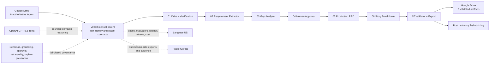

# PRD Genie Architecture Design

> Current canonical submission version: **v0.3.8**. Formal runtime evidence is anchored to parent execution `11901` / `RUN-S2-11902-16e7090e`. Immutable prior snapshots remain in [`docs/architecture/versions/`](versions/README.md).

## 1. Purpose and status

This document defines the accepted v0.3.8 technical architecture for PRD Genie. A manual n8n parent coordinates Drive Intake and Clarification, Requirement Extraction, Gap Analysis, signed Human Approval, Production PRD, Story Breakdown, Final Validation and Export, plus post-export advisory Story Sizing. OpenAI supplies bounded semantic reasoning; deterministic code controls and an enforced Agreement Gate govern release; Langfuse records traces, evaluator results, latency, tokens, and cost; and Google Drive receives seven validated run-specific artifacts.

Formal parent execution `11901` / run `RUN-S2-11902-16e7090e` completed the governed path in 2m 33.201s. It reconciled 145/145 citation dispositions with zero orphaned governed records, delivered three Epics, seven Features, eleven Stories and eleven mapped acceptance criteria, authorized release, exported seven artifacts, and returned advisory sizing for 11/11 stories. Fully loaded usage was 545,467 tokens at `$1.474409`. Execution `11958` is supplementary post-tidy-up demonstration evidence and does not replace the formal baseline.

## 2. Architecture principles

1. Ground every factual output in approved evidence.
2. Use one clear responsibility per agent.
3. Exchange strict, versioned JSON contracts between stages.
4. Stop or request clarification when input is insufficient or materially contradictory.
5. Require human approval before generative document creation.
6. Preserve stable IDs across the complete evidence chain.
7. Trace every LLM stage and visible failure path.
8. Prefer incremental implementation over unnecessary orchestration complexity.

## 3. System context

PRD Genie receives either one evaluation-control input or a production-style source packet from a PM, TPM, evaluator, or file-ingestion step. The source packet preserves separate source IDs, types, raw text, provenance, line citations, metadata, and SHA-256 hashes. n8n normalizes and validates the selected route, coordinates agents, applies routing and approval gates, and exports the final Markdown. OpenAI performs structured language tasks. Langfuse records traces and evaluation evidence. GitHub stores versioned implementation and submission artifacts; Obsidian mirrors working project documentation.

The production packet is represented as an auditable evolution rather than a static claim that the project began with six inputs. The initial discovery set contains the immutable Product Brief, Meeting Transcripts, and Stakeholder Notes. The governed clarification history adds three human-authored decision records dated August 7, 2026: the primary clarification, its approved amendment, and the mobile-release clarification. Formal baseline execution `11901` consumed all six approved documents. The clarification contract preserves original evidence, explicit decision IDs, and bounded supersession rules so later decisions change the applicable state without erasing history.

## 4. Logical architecture



The compact diagram above is the document overview. The complete editable submission diagram is stored in `assets/diagrams/prd-genie-architecture-v0.3.8.mmd`; it separates input, n8n orchestration, semantic reasoning, governance, observability, delivery, and public evidence boundaries. Earlier diagram versions remain historical records.

## 5. Orchestration pattern

PRD Genie uses a sequential pipeline because each downstream artifact depends on an approved upstream artifact. Extraction must precede PRD generation, and the approved PRD must precede story generation. Conditional branches handle clarification, refusal, validation failure, and human revision without changing the main dependency chain.

A router is unnecessary for the MVP because normalized inputs share the same semantic stages. Hierarchical orchestration would add coordination complexity without improving the supplied single-source baseline cases.

### 5.1 Why Gap Analysis precedes PRD generation

The Gap Analyzer is intentionally placed between validated Requirement Extraction and the PRD Generator. Architecturally, it is a pre-generation readiness and safety boundary: the Requirement Extractor establishes what the evidence says, the Gap Analyzer determines whether that evidence is sufficiently complete and internally consistent for controlled generation, and the PRD Generator formats only information that has passed the gate and human review.

This placement provides the following architectural benefits:

| Concern | Architectural rationale |
|---|---|
| Separation of concerns | Extraction, readiness assessment, and document generation remain distinct responsibilities with separate contracts. |
| Fail-fast behavior | Material gaps and contradictions stop or redirect the pipeline before downstream model calls create a PRD or stories. |
| Hallucination prevention | Unknown information is clarified, blocked, or explicitly marked for `TBD` treatment instead of being silently completed by a generator. |
| Stable downstream contract | The PRD Generator receives an approved extraction plus an explicit eligibility decision rather than interpreting readiness itself. |
| Lower coupling | The Gap Analyzer needs the Requirement Extraction contract only; it does not need to understand both PRD and Story output structures. |
| Reduced cost and rework | The pipeline avoids generating and later discarding a PRD and story set when the source is not ready. |
| Traceability and observability | The sequence `extract -> analyze -> gate -> approve -> generate` records why generation was allowed, clarified, or blocked. |
| Human control | The deterministic gate routes eligible cases to approval before any generative document-creation stage begins. |

Placing a checker only after PRD and Story generation would detect some defects, but only after unsupported assumptions or contradictions may have propagated across multiple artifacts. Downstream checking therefore remains valuable but has a different responsibility:

- the pre-generation **Gap Analyzer** evaluates source sufficiency, ambiguity, contradictions, risks, and generation readiness;
- the post-generation **PRD Validator** evaluates PRD grounding, completeness, template compliance, and approved-source use; and
- the post-generation **Story/Consistency Validator** evaluates story coverage, acceptance criteria, and cross-stage traceability.

The approved architectural decision is therefore to retain the Gap Analyzer before the PRD Generator and use specialized downstream validators as additional controls rather than moving the Gap Analyzer to the end of the pipeline.

Decision-rationale groundedness: **100%**. The placement follows the approved sequential orchestration, strict stage contracts, deterministic generation gate, human-approval requirement, traceability model, and zero-unsupported-claim target.

## 6. Components and responsibilities

| Component | Responsibility | Input contract | Output contract | Status |
|---|---|---|---|---|
| Input Normalizer | Create a consistent run envelope without merging alternative producers | Evaluation source or validated source packet | Workflow Input / Source Packet | Single-source implemented; local PB+MT+SN packet contract validated |
| Input Validator | Reject invalid envelopes | Workflow Input | Validated Workflow Input | Implemented |
| Requirement Extractor | Extract grounded product information | Workflow Input | Requirement Extraction | Implemented; v1.5 release regression passed 10/10 |
| Gap Analyzer | Identify missing, ambiguous, contradictory, or blocking information | Requirement Extraction | Gap Analysis | Implemented; v1.0 release regression passed 10/10 |
| Generation Gate | Route according to sufficiency and safety | Gap Analysis | Gate decision | Implemented and verified across T1-T10 |
| Human Approval | Approve, condition, reject, or redirect grounded items | Extraction, Gap Analysis and gate result | Human Review | Implemented; all five eligible T-test routes passed at 100% with Langfuse evidence |
| PRD Generator | Produce the ten-section Markdown PRD | Approved extraction and template | PRD Output | Implemented for T11/T1; observable release passed at 100%, actual JSON/Markdown preserved, Langfuse accepted |
| Story Breakdown | Produce epics, features, stories, and story acceptance criteria | Approved PRD | Story Breakdown | Implemented; accepted v0.3.8 produced 3 Epics / 7 Features / 11 Stories / 11 mapped criteria |
| Connected Orchestrator | Own the run envelope, invoke children, preserve trace context, and enforce routes | Workflow Input and stage envelopes | Connected final result and artifact package | Implemented; formal parent execution `11901` completed the accepted v0.3.8 path |
| Final Validator and Export | Enforce cross-stage grounding, set equality, orphan prevention, Agreement Gate release, and seven-artifact export | All downstream outputs | Evaluation Result and delivery package | Implemented and accepted in execution `11901` |
| Story Sizing | Propose non-blocking size, confidence, rationale, and refinement guidance | Validated stories | Advisory sizing artifact | Implemented post-export; 11/11 stories sized in execution `11901` |
| Failure Observer | Record workflow failures | n8n error event | Failure trace | Implemented |
| Langfuse Adapter | Emit trace, generation, validation, usage, cost, and deterministic approval-audit data | Run context and stage data | Accepted trace and evaluator evidence | Implemented across the governed run; fully loaded baseline usage and cost are preserved |

## 7. Data contracts

The machine-readable boundary includes the standalone control schemas plus a separate realistic-v4 Story Breakdown schema. Contracts reject unknown properties, control status values, preserve IDs, and require source evidence or approved upstream references. `docs/architecture/SOURCE_PACKET_CONTRACT.md` defines the multi-source producer boundary; the realistic Story Breakdown contract preserves all six hashes and upstream approval/PRD lineage.

Schema changes require a version update, regression validation, and documentation of downstream impact.

## 8. Grounding and traceability

The target is 100% traceability of factual generated items and zero unsupported claims in the final evaluated baseline. Grounding does not imply perfect extraction completeness; completeness and classification accuracy are measured independently.

```text
Source quote -> Extracted ID -> Human approval -> PRD ID -> Story ID -> Evaluation and trace
```

Missing mandatory PRD content is written as `TBD - stakeholder input required` and linked to an open question. Contradictions remain unresolved until a human supplies a decision.

## 9. Human approval design

The approval stage receives the extraction, Gap Analysis, and deterministic gate result. It records the reviewer, timestamp, decision, approved/rejected IDs, reviewed gaps, controlled TBDs, conditions, evidence checks, notes, and deterministic next route. Material content revisions are not silently authored in the checkpoint; they return to correction for re-extraction and evaluation. Only approved content and explicitly approved conditions/TBDs are passed to the PRD Generator. Rejected or unreviewed items cannot appear downstream. The complete contract is defined in `docs/architecture/HUMAN_APPROVAL_CONTRACT.md`.

## 10. Observability

Each LLM stage should create a Langfuse generation nested under one pipeline trace. Required metadata includes run ID, test ID, agent name, prompt version, model, input, output, validation, latency, input/output tokens, estimated cost, environment, and error details. Validation and failure observations remain visible even when the pipeline stops.

The Requirement Extractor, Gap Analyzer, Production PRD, Story Breakdown, and Story Sizing stages preserve model and evaluator observations alongside deterministic controls. Human Approval emits a non-LLM audit span with decision, route, and evidence checks. One run identity connects parent and child executions, source and delivery artifacts, evaluator results, and cost. The complete formal inventory is recorded in `releases/v0.3.8/evidence/workflow-inventory-v0.3.8.md`; execution `11958` adds a supplementary reviewer-facing HTML trace report without changing the formal baseline.

## 11. Failure handling

| Failure | Response |
|---|---|
| Invalid workflow input | Stop before the LLM and record validation failure |
| Invalid model JSON | Parse or retry only within documented limits; otherwise stop and trace failure |
| Schema violation | Block downstream execution and record exact validation errors |
| No meaningful requirements | Return refusal and clarification request; do not generate PRD |
| Blocking ambiguity or contradiction | Request clarification and prevent generation |
| Human rejection | Return for revision or stop according to reviewer decision |
| Langfuse ingestion issue | Preserve workflow result and record observability failure for remediation |

## 12. Security and privacy

- Secrets remain in n8n credentials or approved environment configuration.
- Workflow exports are inspected before commit.
- Screenshots exclude credentials, account identifiers, personal email addresses, and secret-bearing URLs.
- Supplied project resources remain read-only.
- The submission repository is public and contains only submission-safe artifacts. Secret scans exclude credentials, signed resume URLs, private keys, and environment-specific values; `.env.example` contains placeholders only.

## 13. Deployment and environments

The accepted capstone baseline runs manually in n8n Cloud, reads controlled Google Drive inputs, sends traces and evaluator evidence to Langfuse US, and writes authorized outputs to Google Drive. Exported JSON workflows are versioned in GitHub and do not execute from the repository. Autonomous production triggers, scaling, retention, enterprise identity, and role-based access remain outside the MVP.

## 14. Architecture evolution

This accepted submission architecture is version 0.3.8. Material final-state decisions are recorded in ADR-004; earlier accepted ADRs remain historical and are not silently rewritten.

### Version history

| Version | Date | Summary | Snapshot |
|---|---|---|---|
| 0.2 | 2026-08-04 | Standalone architecture baseline before connected downstream completion | [`ARCHITECTURE_DESIGN-v0.2.md`](versions/ARCHITECTURE_DESIGN-v0.2.md) |
| 0.3 | 2026-08-06 | Connected T1-to-T12 path verified; logical architecture updated for parent/child orchestration | [`ARCHITECTURE_DESIGN-v0.3.md`](versions/ARCHITECTURE_DESIGN-v0.3.md) |
| 0.4 | 2026-08-06 | Technical system boundaries added for n8n Cloud, OpenAI, Langfuse, contracts, credentials, storage, GitHub, Obsidian and failure handling | Historical design source [`prd-genie-architecture-v0.4.mmd`](../../assets/diagrams/prd-genie-architecture-v0.4.mmd) |
| 0.3.8 | 2026-08-24 | Accepted nine-workflow submission topology, enforced release, post-export sizing, seven-artifact delivery, fully loaded observability, public evidence, and formal execution `11901` | Current canonical submission; editable diagram [`prd-genie-architecture-v0.3.8.mmd`](../../assets/diagrams/prd-genie-architecture-v0.3.8.mmd) |
