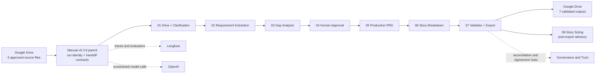

# PRD Orchestrator — Architecture Design — v0.3.8

## 1. Architecture intent

PRD Orchestrator uses one governed run identity to connect authoritative source files, decisions, generated artifacts, evaluations, and exports. The architecture separates language-model reasoning from deterministic release controls and preserves a protected rollback path.

## 2. Architecture principles

1. Ground factual outputs in approved source evidence.
2. Separate extraction, analysis, approval, generation, validation, and sizing responsibilities.
3. Preserve stable identifiers and handoff lineage.
4. Fail closed when governed sets do not reconcile.
5. Keep human approval explicit and accountable.
6. Treat sizing as advisory and non-blocking.
7. Record deterministic and semantic evidence separately.
8. Promote with versioned workflow exports, accepted-run receipts, and rollback evidence.

## 3. End-to-end logical flow



## 4. Runtime topology

The accepted v0.3.8 parent uses a minimal-change hybrid call graph. Six workflows are invoked directly; Requirement Extraction and Gap Analysis remain retained logical contracts within the analysis path. Candidate copies of stable stages exist for a complete nine-workflow export set but are not substituted into the accepted runtime merely to make every ID new.

| Logical stage | Accepted runtime disposition | Runtime workflow ID |
|---|---|---|
| 01 — Drive and Clarification Gate | Direct stable child call | `m4WqDP4xJLhwyBnC` |
| 02 — Requirement Extractor | Retained logical analysis contract | Nested within accepted analysis path |
| 03 — Gap Analyzer | Retained logical analysis contract | Nested within accepted analysis path |
| 04 — Human Approval | Direct stable child call | `pui6krDb6mF9emRH` |
| 05 — Production PRD | Direct v0.3.8 child call | `ocoEGqFDyzzFYf3U` |
| 06 — Story Breakdown | Direct v0.3.8 child call | `kswPN0mT0u7rp4vq` |
| 07 — Final Validator and Export | Direct stable child call | `PCV1gEpUt8ZxOVyw` |
| 08 — Story Sizing | Direct v0.3.8 post-export call | `cFuv8QCLpLhtX6A6` |

Parent orchestrator: `YCgHHBa8xUvSOYGI`.

## 5. Complete candidate workflow set

| # | Candidate workflow | Live n8n ID | Candidate disposition |
|---:|---|---|---|
| 00 | Main Orchestrator | `YCgHHBa8xUvSOYGI` | Accepted parent |
| 01 | Drive Intake and Clarification Gate | `CQEgz6G2sPHhehjW` | Complete snapshot copy |
| 02 | Requirement Extractor | `YcNGjVHdyAJgZeod` | Complete snapshot copy |
| 03 | Gap Analyzer | `6F4ANeRIDJVkA28C` | Complete snapshot copy |
| 04 | Human Approval | `uMSo2zvHLGWcM2vo` | Complete snapshot copy |
| 05 | Production PRD | `ocoEGqFDyzzFYf3U` | Invoked v0.3.8 stage |
| 06 | Story Breakdown | `kswPN0mT0u7rp4vq` | Invoked v0.3.8 stage |
| 07 | Final Validator and Export | `gU24pjEsig7u60S4` | Complete snapshot copy |
| 08 | Story Sizing | `cFuv8QCLpLhtX6A6` | Invoked advisory stage |

## 6. Component responsibilities

| Layer or component | Responsibility |
|---|---|
| Google Drive inputs | Authoritative current-run text and hashes |
| Main orchestrator | Manual trigger, run ID, stage invocation, polling, and lineage |
| Requirement Extractor | Grounded item extraction and citation classification |
| Gap Analyzer | Gaps, conflicts, ambiguity, risks, and clarification needs |
| Human Approval | Signed decisions and approved scope |
| Production PRD | Approved evidence → corrected ten-section PRD and feature acceptance criteria |
| Story Breakdown | PRD → Epic → Feature → Story → story acceptance criteria |
| Final Validator and Export | Bidirectional reconciliation, Agreement Gate, and seven-file delivery |
| Story Sizing | Advisory size, confidence, and refinement guidance after export |
| OpenAI intelligence layer | Constrained extraction, analysis, generation, decomposition, and sizing |
| Langfuse observability layer | Traces, code/LLM evaluators, latency, tokens, and loaded cost |
| Governance and trust layer | Citations, approval, set equality, orphan prevention, and fail-closed release |

## 7. Governed handoff contract

Every direct stage handoff preserves:

- `run_id` and trace correlation
- approved source content and hashes
- citation and requirement identifiers
- human decisions and approved scope
- artifact identifiers and validation status

The parent uses workflow IDs rather than names for invocation; copying or renaming a workflow creates a new ID and therefore requires deliberate parent rewiring and regression validation.

## 8. Grounding and traceability

```text
Source file → Citation ID → Requirement ID → PRD feature/criterion
→ Epic → Feature → User Story → Story acceptance criteria
```

The validator reconciles the governed sets in both directions. The accepted run contains 145 indexed citations, 145 terminal dispositions, zero orphan citations, zero orphan PRD elements, and zero orphan delivery items.

## 9. Evaluation and observability

- Deterministic code controls validate structure, exact values, counts, set equality, and release conditions.
- LLM evaluators assess faithfulness, hallucination, and sizing reasonableness.
- Stage-specific evaluators are used where generic semantic judging is insufficient.
- Duplicate semantic scoring was removed for v0.3.8.
- Accepted loaded usage: 545,467 tokens across generation and invoked evaluators.
- Accepted loaded cost: `$1.474409`.

## 10. Security and operational controls

- Credentials remain in n8n connections and are excluded from exported JSON and documentation.
- Inputs and outputs remain in controlled Google Drive locations.
- The production trigger remains manual during the pilot.
- Export occurs only after final validation and Agreement Gate authorization.
- Story sizing runs after export and cannot block accepted delivery.
- GitHub preserves submission-safe workflow exports and evidence.

## 11. Failure behavior

| Failure | Architecture response |
|---|---|
| Missing or malformed source | Stop or request clarification before generation |
| Blocking ambiguity or contradiction | Preserve the issue and route for human decision |
| Invalid structured or Markdown output | Block downstream execution and record validation evidence |
| Citation/PRD/delivery mismatch | Fail the Agreement Gate; do not export |
| Human rejection | Stop or return to correction according to the recorded route |
| Sizing failure | Preserve accepted export; record advisory-stage failure separately |

## 12. Accepted baseline and rollback

| Item | Accepted value |
|---|---|
| Parent execution | `11901` |
| Run ID | `RUN-S2-11902-16e7090e` |
| Duration | 2m 33.201s |
| Agreement Gate | Release authorized |
| Delivery | Seven validated files |
| Protected fallback | v0.3.7 unchanged |
| v0.3.7 exact workflow snapshot | Git commit `c5ae311` |
| v0.3.7 checkpoint merge | Git commit `57618f6` / PR #16 |
| v0.3.8 accepted package | Git commit `077f77c` |

The next architecture change is labeled **proposed v0.3.9** and requires a separate candidate, canary, evaluation, and promotion decision.
